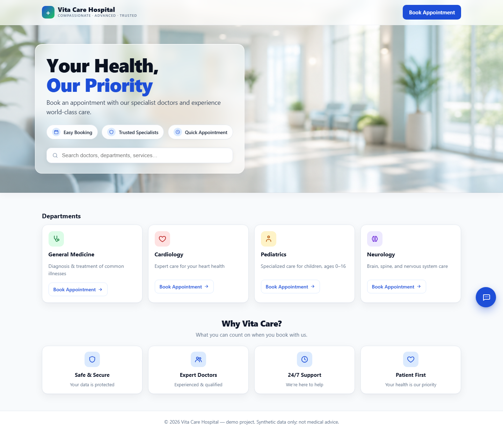
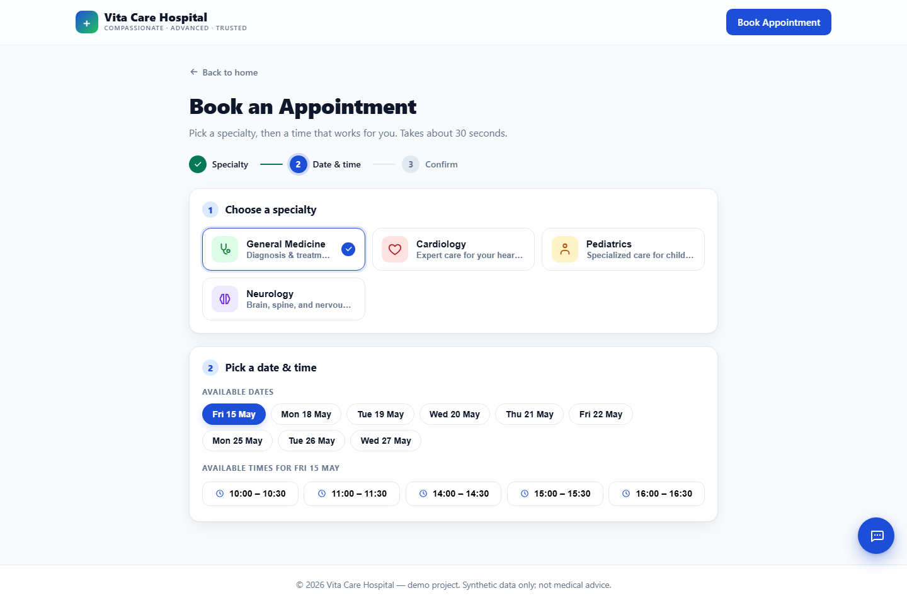
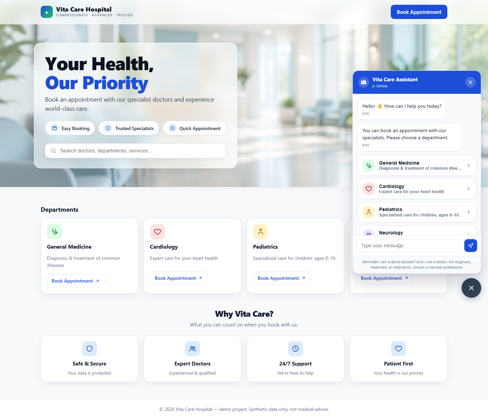
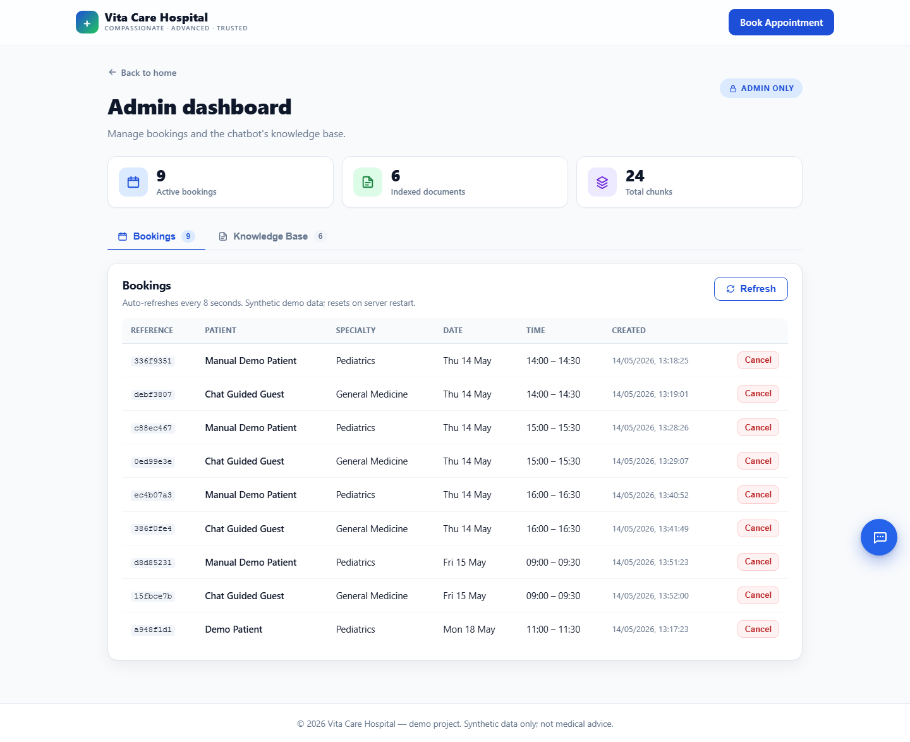
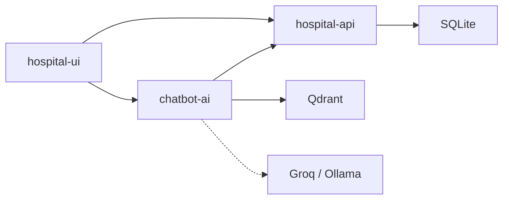

# Vita Care Hospital

**Book appointments. Chat with an assistant grounded in hospital docs. See how LLM apps are wired in production—not just an API wrapper.**

[](projects/hospital-ui/)
[](projects/hospital-api/)
[](projects/chatbot-ai/)
[](projects/hospital-api/)

Three services · tool-calling agent · RAG over your KB · guardrails for bookings & slot times

---

## Demo

Full walkthrough: title slide → home → manual booking → chat (general + RAG + guided book) → admin KB ingest.

<video src="docs/media/vitacare-demo.mp4" controls playsinline width="100%"></video>

**[▶ Open narrated demo (MP4)](docs/media/vitacare-demo.mp4)** · [Silent WebM](docs/media/vitacare-demo.webm)

Regenerate: `cd projects/hospital-ui` → `npm run capture:portfolio:voice` — see [`docs/media/README.md`](docs/media/README.md).

---

## Screenshots

| | |
|:---:|:---:|
| **Home** — departments from the booking API | **Book** — manual slot flow on `/book` |
|  |  |
| **Assistant** — chat + guided cards | **Admin** — bookings & knowledge-base ingest |
|  |  |

---

## What this project is

**Vita Care Hospital** is a portfolio-grade demo: a React SPA talks to a **booking API** (SQLite) and a **chatbot API** (Groq or Ollama + Qdrant). Patients book without the LLM on the happy path; the assistant can book via tools, search ingested FAQs, and fall back safely when docs are empty.

| You get | How |
| --- | --- |
| Guided booking | Card UI + optional LLM tool calls to the same JSON API |
| Hospital Q&A | RAG (`search_hospital_docs`) with no invented hospital facts |
| KB admin | Upload `.txt` / `.md` / `.pdf` / `.docx` → chunk → embed → Qdrant |
| Safer replies | Emergency gate, booking-truth guard, slot-time checks |

**Stack:** React + Vite · FastAPI ×2 · SQLite · Qdrant · Ollama embeddings · Groq or Ollama chat.

---

## Architecture

```text
Browser  →  hospital-ui (:5173)
              ├─ /api/*  →  hospital-api (:8001)  SQLite
              └─ /ai/*   →  chatbot-ai (:8000)    tools + RAG → Qdrant, Groq/Ollama
```



Diagrams & trade-offs: [`docs/architecture.md`](docs/architecture.md) · [`docs/design-decisions.md`](docs/design-decisions.md) · [FigJam board](https://www.figma.com/board/PB1RG62anB240Bv1Dgu0ii)

---

## Run locally

```powershell
docker run -p 6333:6333 -p 6334:6334 qdrant/qdrant

# Terminal 2 — booking API (:8001)
cd projects\hospital-api ; .\.venv\Scripts\activate
python -m uvicorn app.main:app --reload --port 8001

# Terminal 3 — chatbot (:8000)
cd projects\chatbot-ai ; .\.venv\Scripts\activate
python -m uvicorn app.main:app --reload --port 8000

# Terminal 4 — UI (:5173)
cd projects\hospital-ui ; npm run dev
```

Open **http://127.0.0.1:5173** — chat FAB bottom-right.

| Service | README |
| --- | --- |
| UI | [`projects/hospital-ui/README.md`](projects/hospital-ui/README.md) |
| Booking API | [`projects/hospital-api/README.md`](projects/hospital-api/README.md) |
| Chat + RAG | [`projects/chatbot-ai/README.md`](projects/chatbot-ai/README.md) |

---

## Highlights (for reviewers)

- **Hand-written agent loop** — LangChain only for loaders / split / Qdrant; orchestration stays readable in `chat_service.run_chat`.
- **Guardrails** — no “booked” without a tool `id`; slot times checked against `list_slots`; malformed tool calls recovered.
- **RAG policy** — Vita Care facts only from snippets; general medical answers prefixed when KB is empty.
- **Idempotent ingest** — re-upload same filename replaces chunks, no duplicates.

---

## Repo layout

```text
docs/           architecture, design notes, media, screenshots
projects/
  hospital-ui/    React + Vite + capture scripts
  hospital-api/   FastAPI booking + SQLite
  chatbot-ai/     FastAPI chat, tools, RAG, tests
```

Demo-grade, single-machine — useful as a reference for grounded LLM apps and a base for auth, observability, and deployment.
