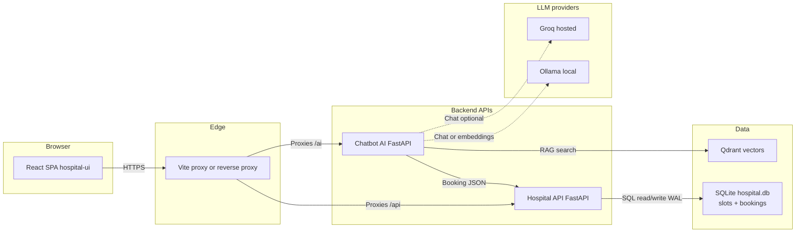
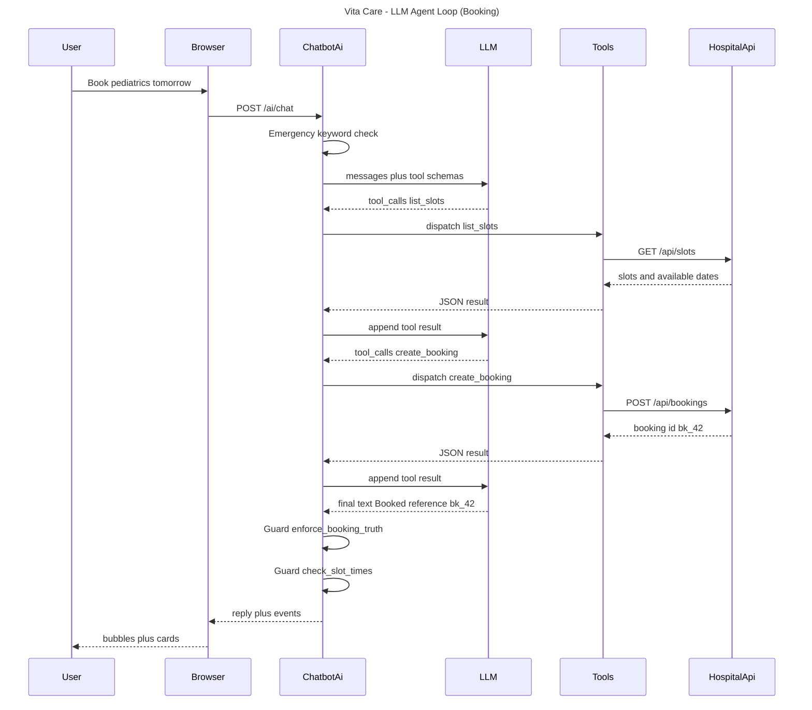
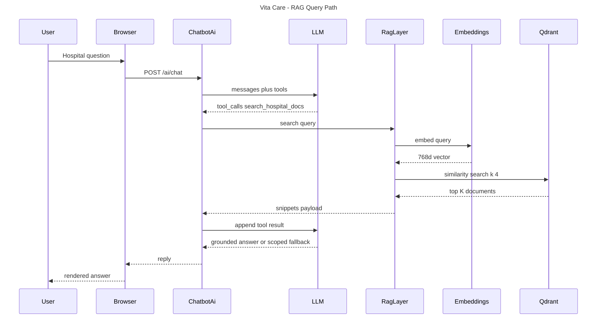
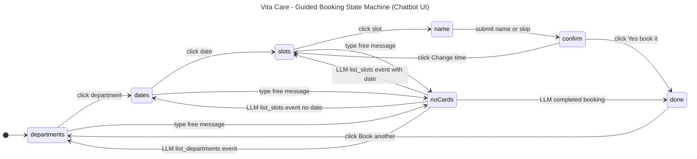
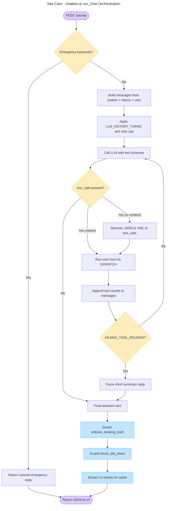

# Vita Care Hospital — System architecture

Six diagrams cover the project end-to-end. Each one isolates a single concern so it stays readable in interviews and portfolio reviews.

| # | Diagram | Type | What it answers |
| - | --- | --- | --- |
| 1 | Runtime / query path | Architecture (LR) | What does every user request touch? |
| 2 | Knowledge-base ingestion | Flowchart (LR) | How do documents become searchable vectors? |
| 3 | LLM agent loop (booking) | Sequence | How does the model use tools to make a booking? |
| 4 | RAG query + empty-result fallback | Sequence | How does a hospital-FAQ question flow, and what happens when nothing matches? |
| 5 | Guided booking state machine | State diagram | How does the chatbot UI move between cards and free chat? |
| 6 | `chatbot-ai` `run_chat` orchestration | Flowchart (TD) | How does the backend interleave LLM calls, guards, and tool dispatch? |

The Mermaid blocks below are the **source of truth in Git**. When the architecture changes (for example **`hospital-api` uses SQLite**), update the matching § diagram in this file (see **Maintaining the diagrams** at the end).

---

## 1. Runtime / query path

Shows what every interactive request touches. Dotted lines are outbound LLM / vector calls; solid lines are internal HTTP.

### Component summary

| Layer | Component | Role |
| --- | --- | --- |
| **Client** | `hospital-ui` (React + Vite) | Home, book flow, floating chatbot, admin KB UI. Talks only to same-origin paths `/api` and `/ai`. |
| **Gateway** | Vite dev proxy / reverse proxy in prod | Routes `/api` → Hospital API, `/ai` → Chatbot AI. |
| **Service** | `hospital-api` (FastAPI) | JSON booking API; demo slots/bookings in a local SQLite file. |
| **Service** | `chatbot-ai` (FastAPI) | LLM chat, tool calls to hospital-api, RAG over Qdrant, embeddings via Ollama. |
| **Datastore (bookings)** | SQLite (`data/hospital.db` via `hospital-api`) | Demo slots and bookings persist across API restarts; WAL for light concurrency. |
| **Datastore (RAG)** | Qdrant | Vector index for hospital docs / FAQs. |
| **External** | Groq | Optional hosted chat model (OpenAI-compatible API). |
| **External** | Ollama | Local chat model and/or embedding model (`nomic-embed-text` for RAG). |

### Typical request paths

1. **Book from UI** — Browser → proxy → `hospital-api` (`POST /api/bookings`, etc.).
2. **Chat** — Browser → proxy → `chatbot-ai` (`POST /ai/chat`). Model may call tools that hit `hospital-api` or `search_hospital_docs` → Qdrant; chat/embedding calls may go to Groq and/or Ollama depending on `.env`.

---

## 2. Knowledge-base ingestion path

Separated from the runtime view because ingestion runs **out of band** — admins upload documents and the index gets rebuilt; no chat traffic touches this path until a user later asks a question.

```mermaid
flowchart LR
    operator["Operator in Admin page"] -->|"Multi-file upload txt md pdf docx"| adminRoute["POST /ai/admin/ingest"]
    seedFiles["knowledge folder seed files"] -->|"python scripts/ingest.py"| seedScript["Seed script"]
    adminRoute --> save["save_upload to data/uploads"]
    save --> deleteOld["delete_source remove prior chunks same filename"]
    seedScript --> deleteOld
    deleteOld --> loader["LangChain loader TextLoader PyPDFLoader Docx2txtLoader"]
    loader --> splitter["RecursiveCharacterTextSplitter chunk 600 overlap 100"]
    splitter --> embed["OllamaEmbeddings nomic-embed-text 768d"]
    embed --> qdrant["Qdrant collection vitacare_docs cosine upsert"]
    qdrant --> response["JSON response chunks added prior removed"]
    response --> ui["Admin UI documents table refresh"]
```

### Pipeline summary

| Step | Where | Notes |
| --- | --- | --- |
| **Trigger** | `POST /ai/admin/ingest` (Admin UI) **or** `scripts/ingest.py` (seed) | Both paths converge on `app/ingest_service.ingest_file`. |
| **Persist upload** | `app/ingest_service.save_upload` → `data/uploads/` | Filename is sanitised + UUID-prefixed; size capped by `MAX_UPLOAD_BYTES`. |
| **Idempotency** | `delete_source(filename)` | Same-name re-uploads replace prior chunks (no duplicates). |
| **Load** | LangChain loaders | `TextLoader` (`.txt`/`.md`), `PyPDFLoader` (`.pdf`), `Docx2txtLoader` (`.docx`). |
| **Chunk** | `RecursiveCharacterTextSplitter` | `chunk_size=600`, `chunk_overlap=100`, markdown-aware separators. |
| **Embed** | `OllamaEmbeddings` (`nomic-embed-text`) | 768-dim vectors, computed locally. |
| **Upsert** | `langchain-qdrant` → Qdrant | Collection `vitacare_docs`, cosine distance, payload includes `source`, `file_type`, `ingested_at`. |
| **Surface** | API response + UI table refresh | Response includes `chunks` and `replaced_chunks` per file. |

---

## 3. LLM agent loop — booking flow

A worked example of the agent loop in `chatbot-ai/app/chat_service.run_chat`. The model is given a tool catalogue, then iterates: respond → call tool → see result → respond again, until it produces final text. Guards run after the final text is produced.

**Why this matters for a portfolio**: the system isn't a thin LLM wrapper — there's a deterministic loop, validated tool I/O, and post-hoc guards that catch hallucinated bookings or invented slot times before they reach the user.

---

## 4. RAG query path (with three-way fallback)

Hospital-FAQ questions are answered by the `search_hospital_docs` tool, which embeds the query, searches Qdrant, and returns snippets. The diagram shows the happy path; the three-way fallback for empty results is implemented in `chat_service.SYSTEM_PROMPT` and summarised in prose below the diagram.

**The "grounded answer or scoped fallback" step** branches three ways inside the LLM:

| Snippets state | LLM behaviour |
| --- | --- |
| **Found** | Answers strictly from snippets and cites the source filename. |
| **Empty + Vita Care-specific** (e.g. "What are *your* visiting hours?") | Replies "I couldn't find that in Vita Care's documents. Please contact the hospital front desk to confirm." — no invention. |
| **Empty + general medical** (e.g. "What is paracetamol used for?") | Prefixes "I couldn't find this in Vita Care's documents, but here's some general information:" then 4–6 sentences of general knowledge. The UI's static disclaimer at the bottom of the chat does the rest. |

**Why this matters**: the system never silently makes up Vita Care-specific facts, but it still gives a useful general answer when the question is medical but not hospital-specific — a real product trade-off, not just "I don't know".

---

## 5. Guided booking state machine — chatbot UI

The chatbot widget runs a small state machine on the React side. Clicking the cards advances cleanly; typing free text routes through the LLM, which can drop the user back into the card flow via `events`.

**Why this matters**: deterministic tasks (department → date → slot → confirm) are handled by the UI without any LLM call, which keeps cost/latency low and removes a huge surface area for hallucinations. The LLM is only used when the user *deviates* from the happy path.

---

## 6. `chatbot-ai` `run_chat` orchestration

A zoomed-in look at the server-side loop inside `chat_service.run_chat`. Decisions are yellow, post-hoc guards are blue, terminals are violet. Note how malformed tool calls (XML or JSON-in-content) are recovered into the same dispatch path used by native tool calls.

**Why this matters**: the loop has explicit budgets (history cap for Groq TPM, max tool rounds), a recovery path for non-conforming LLMs (Groq sometimes emits `<function=...>` pseudo-XML or raw JSON), and guards that re-check the LLM's claims against ground truth before the reply leaves the building.

---

## Not shown (by design)

- **LangChain** is a library *inside* `chatbot-ai`, not a separate deployable box — so it doesn't appear in the runtime architecture diagram.
- **CI/CD, auth, TLS termination** — add when you harden for production. The codebase already supports `ADMIN_TOKEN` Bearer auth on `/ai/admin/*`.
- **Background scheduling / cron** — there isn't any; ingestion is fully on-demand.

---

## Maintaining the diagrams

Edit the Mermaid blocks in this file when the system changes. Keep titles and labels aligned with the code (for example **SQLite `hospital.db`** on the booking path, not in-process memory). Sequence diagrams use a `title` line after `sequenceDiagram`; state diagrams and flowcharts can use a YAML `title:` frontmatter before the diagram keyword.
